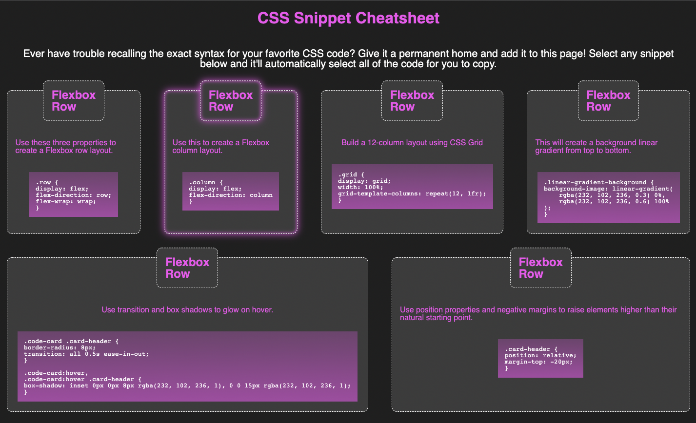

# CSS Snippets

A page with a few CSS techniques both written as raw code that can be copied, and being live demonstrated on the page.

## Installation

Open the browser and navigate the webpage as with any other site.

## Usage

Click any code block to select the effect you wish to implement. The text will automatically be selected in entirety to be copied and pasted to and from your clipboard into your own stylesheets. Keep in mind the class names used may nee to be updated to match the class names on your website.

## Contributions

George Institiute of Technology

## License
[MIT](https://choosealicense.com/licenses/mit/)